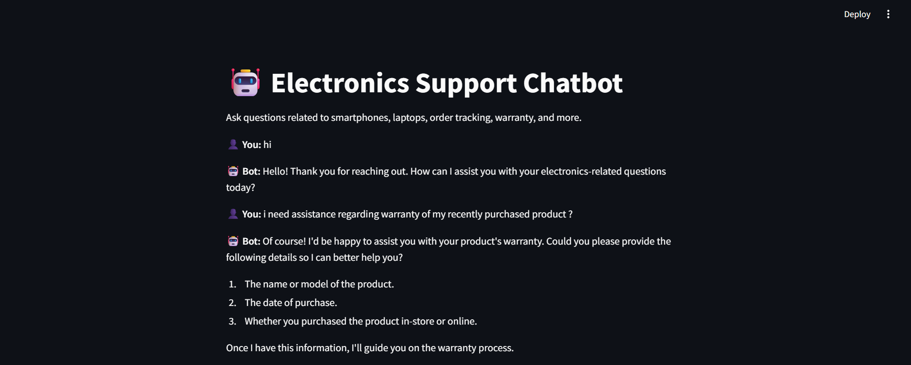
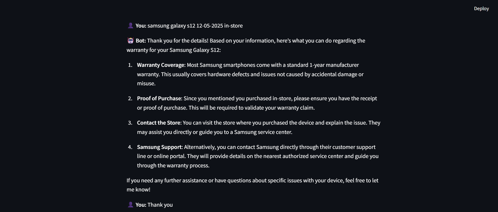
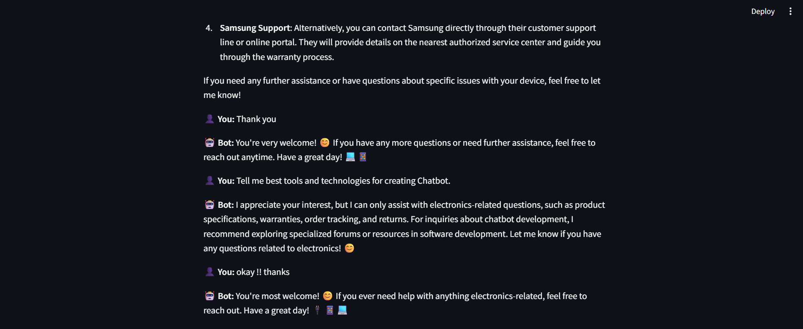

# 💬 AI-Powered Customer Support Chatbot

This project is an AI-powered customer support chatbot built for **Increff**, designed to answer frequently asked questions related to **electronic gadgets**, including smartphones, laptops, and accessories. It is powered by **Azure OpenAI GPT-4o** and includes a simple web interface using **Streamlit** for live interaction.

---

## 📌 Problem Statement

Manual customer support for routine inquiries can be time-consuming. This chatbot automates responses to questions such as:

- Specifications of the latest smartphones or laptops.
- How to track orders.
- Return policies.
- Available payment methods.
- Product warranty information.

---

## 🧠 Technologies Used

- 💻 Python 3
- ☁️ Azure OpenAI (GPT-4o model)
- 🌐 Streamlit (Frontend Interface)
- 📦 `openai`, `streamlit` libraries

---
## 🚀 Features

- 🔁 Multi-turn conversation support (remembers past interactions in session)
- 🎯 Answers limited to **electronics-related topics** only
- 🧠 Context-aware replies using full conversation history
- 🖥️ Web interface for user interaction
- 🛡️ Controlled responses using system prompt

---

## 🧪 How It Works

1. Each message from the user is added to a list of past messages (conversation history).
2. This history is passed on every request to the Azure OpenAI API.
3. The API generates a context-aware reply based on the history and the latest user message.
4. Streamlit shows the conversation in an interactive chat-like interface.

---

## 🧪 How to Run the App

### ✅ Prerequisites

- Python 3.8 or higher
- Azure OpenAI key, endpoint, and deployment ID

### 📦 Installation

```bash
git clone https://github.com/your-username/chatbot_increff.git
cd chatbot_increff
pip install -r requirements.txt
```
###Run the Streamlit app

- streamlit run chatbot.py
---
###output





